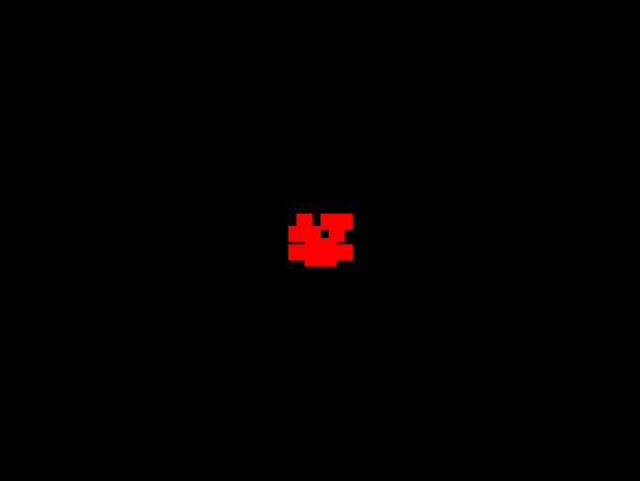

# Lista 02 - Augusto Dornelles Hoff

## exercício 01

## exercício 02

### exercício 03

Ao desenharmos um triangulo da mesma forma de antes, temos um triangulo invertido, pois informamos que o y minimo é o 600 e o maximo é o 00, o que faz com que tenhamos um eixo y invertido, e o ponto 00 comece na esquerda em cima.

Essa configuração é util pois podemos criar nossos vértices com mais facilidade e entendimento dos pontos. Além disso, como temos um plano da mesma proporção da viewport, não temos mais a impressão de "achatamento" em nosso desenho.

### exercício 04

### exercício 05

